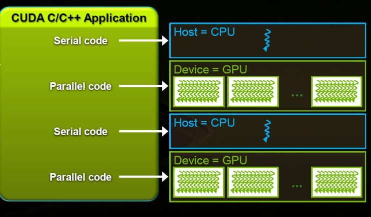

- the host refers to the CPU and its memory, while the device refers to the GPU and its memory. 
- Code run on the host can manage memory on both the host and device, and also launches kernels which are functions executed on the device. These kernels are executed by many GPU threads in parallel.

**GPU Architecture**
  1. Global Memory - used by both cpu and gpu (analogous to ram in a cpu server)
  2. Streaming Multiprocessors (SMs) - performs the actual computations 
    * each SM has programmable (under control of the  program) cache, called shared memory, and local memory: a large register file, used for storing localprogram variables
 
- At CPU host level, the program is sequential with Grid kernel invocations to the GPU.
    * The host code does a kernel call. In this call it defines grid and thread block dimensions
            kernelName<<<gridDims,threadDims>>> (params)

- Grid and block dimensions are declared using variables of predefined type dim3 –with three fields: x, y and z
      * gridDim contains .x and .y grid dimensions (sizes)
      * blockIdx contains block indices .x and .y in the grid
      * blockDim contains the thread block .x, .y, .z dimensions (sizes)
      * threadIdx contains .x, .y and .z thread block indices 
 
    
    
CUDA Appliction structure: 
  - serial code executes in a host(CPU) while Parallel code executes in GPU threads. 
  
  

"A typical sequence of operations for a CUDA C program is:
    Declare and allocate host and device memory.
    Initialize host data.
    Transfer data from the host to the device.
    Execute one or more kernels.
    Transfer results from the device to the host." - [source](https://devblogs.nvidia.com/easy-introduction-cuda-c-and-c/)
  
  
  
  
  Dissecting GPU Memory Hierarchy through Microbenchmarking: [source](https://arxiv.org/pdf/1509.02308.pdf)
  
